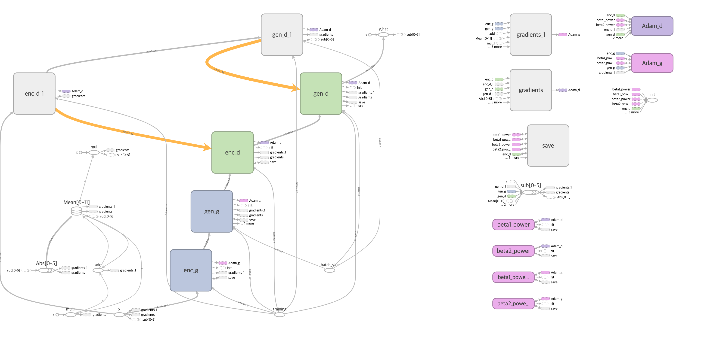

[TensorFlow] Anomaly Detection with Adversarial Dual Autoencoders
=====

TensorFlow implementation of Anomaly Detection with Adversarial Dual Autoencoders (ADAE) with MNIST dataset.  

## Architecture

### Objective Functions

    
  
The objective functions (losses) for training ADAE [1].

### ADAE architecture

    
  
The architecture of ADAE.

### Graph in TensorBoard

    
  
Graph of ADAE.

### Problem Definition

    
  
'Class-1' is defined as normal and the others are defined as abnormal.

## Results

### Training Procedure

  

    
    
    
  

  
Loss graphs in the training procedure. Each graph shows the generative loss, and the two terms that make loss-G.

  

    
    
    
  

  
Loss graphs in the training procedure. Each graph shows the discriminative loss, and the two terms that make loss-G.

    
  
Restoration result by ADAE.

### Test Procedure

  
  
Box plot with encoding loss of test procedure.

  

    
    
    
  

  
Normal samples classified as normal.

  

    
    
    
  

  
Abnormal samples classified as normal.

  

    
    
    
  

  
Normal samples classified as abnormal.

  

    
    
    
  

  
Abnormal samples classified as abnormal.

## Environment
* Python 3.7.4  
* Tensorflow 1.14.0  
* Numpy 1.17.1  
* Matplotlib 3.1.1  
* Scikit Learn (sklearn) 0.21.3  

## Reference
[1] Ha Son Vu et al. (2019). <a href="https://arxiv.org/abs/1902.06924">Anomaly Detection with Adversarial Dual Autoencoders</a>. arXiv preprint arXiv:1902.06924.
